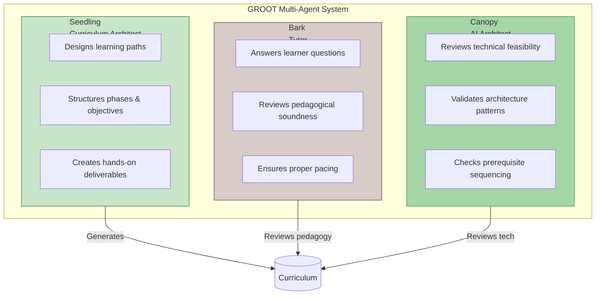
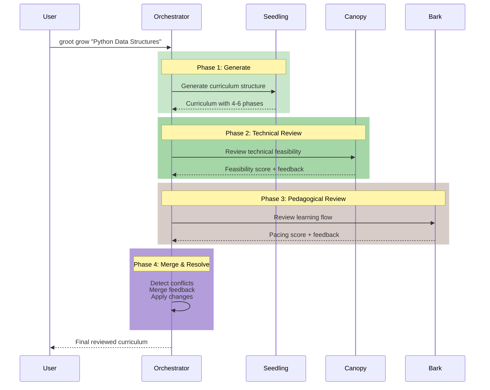
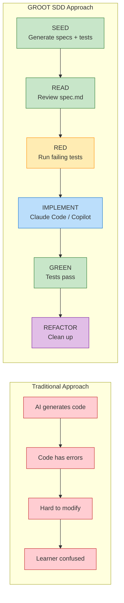
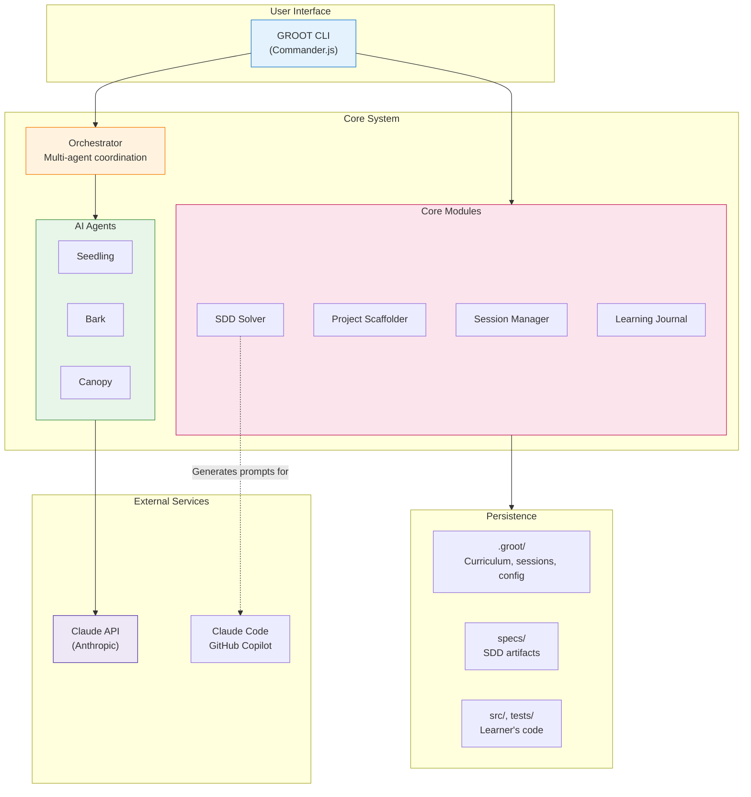

# GROOT: Growing Technical Mastery with Multi-Agent AI

> **"We are Groot. We grow together."**

---

## Presentation Overview

| Section | Time | Key Point |
|---------|------|-----------|
| The Problem | 1 min | Why single AI isn't enough |
| What is GROOT? | 1.5 min | Three specialized agents |
| Multi-Agent Architecture | 2 min | Agent roles & responsibilities |
| Hub-and-Spoke Orchestration | 1.5 min | How agents collaborate |
| Spec-Driven Development | 2 min | Specs over fragile code |
| Solution Architecture | 1.5 min | Technical overview |
| Live Demo | 3-4 min | See it in action |
| Value Proposition | 1 min | Summary & next steps |

**Total: ~12-15 minutes**

---

## 1. The Problem: Why Multi-Agent AI?

### Traditional AI Learning Assistants Fall Short

| Challenge | Impact |
|-----------|--------|
| **Generic curricula** | One-size-fits-all doesn't match individual needs |
| **Fragile AI-generated code** | Syntax errors, truncation, hard to modify |
| **Single-perspective AI** | No AI excels at BOTH pedagogy AND technical architecture |
| **No progress tracking** | Learners lose context between sessions |
| **Theory without practice** | Missing hands-on, project-based deliverables |

### The Insight

> **No single AI agent can be an expert curriculum designer, a patient tutor, AND a seasoned architect.**
>
> The solution: **Specialized agents that collaborate.**

---

## 2. What is GROOT?

**GROOT** = **G**uided **R**esource for **O**rganized **O**bjective **T**raining

A multi-agent AI system that generates personalized, project-based learning curricula.

### The Three GROOT Agents

| Agent | Role | Expertise |
|-------|------|-----------|
| **Seedling** | Curriculum Architect | Designs learning paths, structures phases, creates deliverables |
| **Bark** | Tutor | Answers questions, reviews pedagogical soundness, ensures proper pacing |
| **Canopy** | AI Architect | Reviews technical feasibility, validates architecture, checks prerequisites |

### Growth Stages

Like a tree, learners progress through growth stages:

```
 Seed    Sprout   Sapling    Tree    Flowering  Seeding   Forest
  [ ]  ->  [ ]  ->  [ ]  ->  [ ]  ->   [ ]   ->  [ ]  ->  [ ]

   Start   First   Growing  Strong   Producing  Teaching  Mastery
           steps   skills   skills    results   others
```

---

## 3. Multi-Agent Architecture

### Agent Roles & Responsibilities



### Why This Matters

- **Seedling** focuses purely on curriculum structure - not distracted by implementation details
- **Bark** catches pedagogical issues: "This phase introduces too many concepts at once"
- **Canopy** catches technical issues: "Learners need to understand X before attempting Y"

---

## 4. Hub-and-Spoke Orchestration

### How Agents Collaborate

Agents don't talk directly to each other. The **Orchestrator** coordinates everything.



### Key Benefits

| Pattern | Benefit |
|---------|---------|
| **Central coordinator** | Single source of truth, no agent confusion |
| **Sequential pipeline** | Each agent sees latest state |
| **Conflict detection** | Catches opposing suggestions ("add complexity" vs "simplify") |
| **Debug mode** | `--debug` flag exposes full agent interactions |

---

## 5. Spec-Driven Development (SDD)

### The Innovation: Specs Over Code

**Problem**: AI-generated code is fragile, error-prone, and hard to learn from.

**Solution**: Generate **specifications** that learners implement with Claude Code or GitHub Copilot.



### SDD Artifacts

GROOT generates three files per deliverable:

| File | Purpose | Example Content |
|------|---------|-----------------|
| **spec.md** | Feature specification | Requirements, acceptance criteria, examples |
| **plan.md** | Implementation approach | Architecture decisions, step-by-step approach |
| **tasks.md** | Implementation checklist | Specific, actionable tasks with file paths |

Plus a project-wide `constitution.md` with coding standards.

### Why SDD Works

1. **Specs can't have syntax errors** - they're just markdown
2. **Learners understand the "why"** - specs explain requirements, not just code
3. **Separation of concerns** - GROOT handles curriculum, Claude Code handles implementation
4. **TDD workflow** - tests exist before implementation, ensuring quality

---

## 6. High-Level Solution Architecture



### Key Design Decisions

| Decision | Rationale |
|----------|-----------|
| **CLI-first** | Developers live in terminals; integrates with any workflow |
| **All data in .groot/** | Learner's code is 100% theirs; `rm -rf .groot/` removes GROOT completely |
| **Claude API for agents** | Consistent, high-quality responses with tool use |
| **SDD generates prompts** | Learner uses their preferred AI tool for implementation |

---

## 7. Live Demo Guide

### Quick Demo Commands (3-4 minutes)

```bash
# Create a demo directory
mkdir groot-demo && cd groot-demo

# 1. Initialize GROOT (30s)
groot init
# -> Shows .groot/ directory created

# 2. Multi-agent curriculum generation (90s) - KEY DEMO
groot grow "Python Data Structures" --debug
# -> Watch Seedling generate, Canopy review tech, Bark review pedagogy

# 3. Scaffold project with TDD (45s)
groot seed --phase 1 --template python --tdd
# -> See specs/phase-1/ with spec.md, plan.md, tasks.md
# -> See tests/ with failing tests

# 4. Generate Claude Code prompt (45s)
groot solve --phase 1 --prompt
# -> Ready-to-paste prompt for implementation

# 5. Ask the tutor (30s)
groot ask "What is a hash table?"
# -> Bark responds with clear explanation
```

### What to Point Out During Demo

| Command | Highlight |
|---------|-----------|
| `groot grow --debug` | "Watch the three agents collaborate in real-time" |
| `groot seed --tdd` | "Failing tests + specs created simultaneously" |
| `groot solve --prompt` | "This prompt goes directly into Claude Code" |
| `groot ask` | "Bark uses growth metaphors - 'Every mighty oak started as an acorn'" |

---

## 8. Value Proposition Summary

### Before vs. After GROOT

| Without GROOT | With GROOT |
|---------------|------------|
| Generic curricula | **Personalized** learning paths |
| Fragile AI-generated code | **Durable specs** + TDD workflow |
| Single-perspective AI | **Multi-agent** collaboration |
| No progress tracking | **Session-based** progress |
| Theory without practice | **Project-based** deliverables |
| AI code you don't understand | **You implement** from specs |

### Key Takeaways

1. **Multi-agent > single-agent** - Specialization creates better outcomes
2. **Specs > code generation** - Durable, understandable, learner-implemented
3. **Hub-and-spoke orchestration** - Clean coordination, conflict detection
4. **Growth metaphor** - Motivating progression from seed to forest
5. **Your code stays** - `rm -rf .groot/` leaves your project intact

---

## 9. Getting Started

### Prerequisites
- Node.js 18+
- `ANTHROPIC_API_KEY` environment variable

### Installation
```bash
npm install -g groot
```

### First Steps
```bash
groot init
groot plant "Your Learning Topic" --interactive
groot wake
groot seed --phase 1 --template python
```

### Resources
- GitHub Repository: [link]
- Full demo script: `demo-script.sh` (15 parts, ~30 minutes)
- Documentation: `docs/` directory

---

## Q&A

**Common Questions:**

**Q: How is this different from just asking ChatGPT to create a curriculum?**
> A: GROOT uses three specialized agents that review each other's work. Seedling designs, Canopy reviews technical feasibility, Bark reviews pedagogical soundness. Single-agent approaches miss issues that multi-agent review catches.

**Q: Why generate specs instead of code?**
> A: AI-generated code is fragile - syntax errors, truncation, hard to modify. Specs are durable markdown that clearly describe requirements. Students implement using Claude Code or Copilot, which gives them deeper understanding.

**Q: Can I use this for non-programming topics?**
> A: Yes! Use the `minimal` template for non-code curricula. GROOT works for any structured learning topic.

**Q: What happens to my code when I'm done learning?**
> A: Your code is 100% yours. Run `rm -rf .groot/` and all GROOT data is gone. Your `src/`, `tests/`, and project files remain untouched.

---

*"We are Groot. We grow together."*
